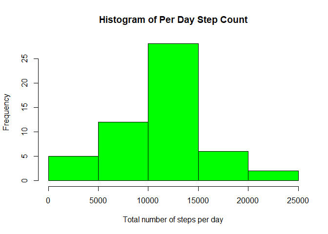
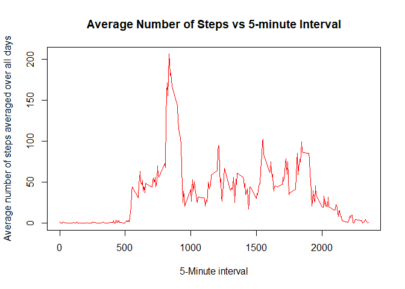
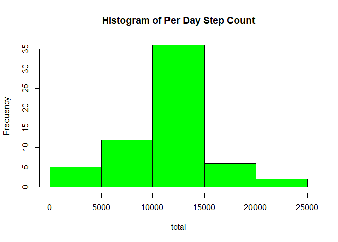
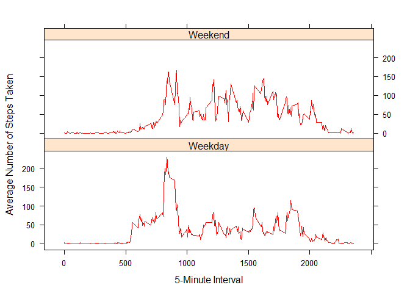

# Reproducible Research - Course Project 1
September 24, 2016  


## Data download and Transformation
The first step of data analysis is to obtain the data. For the project, the data is
available at the [link](https://d396qusza40orc.cloudfront.net/repdata%2Fdata%2Factivity.zip). For convenience, a [Github repository for the assignment](https://github.com/rdpeng/RepData_PeerAssessment1) contains the zipped data file "activity.zip". Hence, there is no need to download it. Nevertheless, the following code will down and extract the data file in case the zip file has been accidently deleted.


```r
# Assign name of the data file
featured_file <- "./activity.csv"
if(!file.exists(featured_file)){
   # Assign link of zipped data file to fileURL
   fileURL <- "https://d396qusza40orc.cloudfront.net/repdata%2Fdata%2Factivity.zip"
   
  # Download data from URL into current directory
   download.file(fileURL,destfile="./activity.zip",method="curl")
   
   # Unzip the data file into current directory
   unzip("./activity.zip",exdir=".")
}  
```

The code above does not download anything since the file *./activity.csv* exists in the current directory. With the available data file, the first step is to read the data from csv file. To perform some simple manipulations on tables/data frames during data analysis, the package "dplyr" will be used. 

```r
#Load the package - dplyr
library(dplyr)
```

```
## 
## Attaching package: 'dplyr'
```

```
## The following objects are masked from 'package:stats':
## 
##     filter, lag
```

```
## The following objects are masked from 'package:base':
## 
##     intersect, setdiff, setequal, union
```
Now read data from file into a data frame.

```r
# Now read in data as a data frame
featured_df <- as.data.frame(read.csv(featured_file,stringsAsFactors = FALSE))
```

Let us collect some basic information on the data that has been read in

```r
dim(featured_df)
```

```
## [1] 17568     3
```

Each data point has information for **3 variables** and there are a total of **17568 data points**. To check the name of the variables

```r
# Name of variables
names(featured_df)
```

```
## [1] "steps"    "date"     "interval"
```

Now let us summarize the data to get a quick overview 

```r
summary(featured_df)
```

```
##      steps            date              interval     
##  Min.   :  0.00   Length:17568       Min.   :   0.0  
##  1st Qu.:  0.00   Class :character   1st Qu.: 588.8  
##  Median :  0.00   Mode  :character   Median :1177.5  
##  Mean   : 37.38                      Mean   :1177.5  
##  3rd Qu.: 12.00                      3rd Qu.:1766.2  
##  Max.   :806.00                      Max.   :2355.0  
##  NA's   :2304
```

At this point, it appears that the variable *steps* has a total of **2304** missing values. Thus, **13.1147541%** of the data for *nsteps* is missing and this represents a fairly large fraction of the dataset. There are no missing values for all other variables.

Note that the column *interval* contains values from *0* to *2355*. Before proceeding with any further analysis, the meaning of *interval* should be stated for clarity. It appears that the value of interval represents the starting time after which the number of steps taken were counted over a five minute interval. Therefore, the interval should be interpreted as having the form HH:MM where HH is the hour and MM is the minute. Based on this interpretation, midnight would correspond to *interval=0* or "*00:00*" and *5* minutes prior to midnight would correspond to *interval=2355* or "*23:55*". 

To see how the interval values are distributed over the data, let us print out the first and last few lines of the data frame

```r
# Print out the top 5 lines of the data
head(featured_df,n=5)
```

```
##   steps       date interval
## 1    NA 2012-10-01        0
## 2    NA 2012-10-01        5
## 3    NA 2012-10-01       10
## 4    NA 2012-10-01       15
## 5    NA 2012-10-01       20
```

```r
# Print out the bottom 5 lines of the data
tail(featured_df,n=5)
```

```
##       steps       date interval
## 17564    NA 2012-11-30     2335
## 17565    NA 2012-11-30     2340
## 17566    NA 2012-11-30     2345
## 17567    NA 2012-11-30     2350
## 17568    NA 2012-11-30     2355
```

It appears that interval data is ordered such that it starts from a value of 0 and ends at the value of 2355 each day.

One final point that needs to be considered is that the *date* variable is listed as class  "character". Usually, it is preferable to convert dates to class "date" for manipulation of date information. As a final step, the *date* data is converted to type "date"

```r
featured_df$date <- as.Date(featured_df$date)
```

Now, we are ready to gather the information required for the project.

## What is mean total number of steps taken per day?
For this part of the project, information on the total number of steps taken each day is required. The following code first removes all NA values, then groups all data by date, and calculates the total number of steps taken for each day. The resulting data is stored in the data frame *summarized_df*


```r
summarized_df <-  featured_df %>%
    filter(complete.cases(.)) %>%
    group_by(date) %>%
    summarize(total=sum(steps))
```

The distribution of total number of steps taken per day is shown below

```r
with(summarized_df, hist(total, col="green", xlab="Total number of steps per day", ylab="Frequency", main="Histogram of Per Day Step Count"))
```

<!-- -->

The mean value of the total number of steps per day is

```r
mean(summarized_df$total)
```

```
## [1] 10766.19
```

Note that the number of steps measured is a discrete quantity and only integer values
are listed in the data. The calculated average number of steps for any given interval may not be an integer. Thus, the number of steps could be rounded off to the nearest integer with the following

```r
round(mean(summarized_df$total))
```

```
## [1] 10766
```

The median of the total number of steps per day is

```r
median(summarized_df$total)
```

```
## [1] 10765
```

Since median picks out the central value, it is not plagued by fractional values such as those found for the mean.

## What is the average daily activity pattern?
To analyze average daily activity patterns, the data for all days has to be grouped by interval and the mean number of steps should be calculated after that. The following code accomplishes this

```r
# Filter out NA's, group by interval, and average step values
summarized_df2 <- featured_df %>%
    filter(complete.cases(.)) %>%
    group_by(interval) %>%
    summarize(average=mean(steps))
```
Rounding off the average number of steps to the nearest integer with the following

```r
summarized_df2$average <- round(summarized_df2$average)
```

With the mean number of steps taken for each interval, the following code generates the time series plot of the 5-minute interval (x-axis) and the average number of steps averaged over all days.

```r
with(summarized_df2, plot(interval, average, type="l", col="red", ylab="Average number of steps averaged over all days", xlab="5-Minute interval", main="Average Number of Steps vs 5-minute Interval"))
```

<!-- -->

To identify the interval for which the number of steps is maximum, 

```r
which(summarized_df2[,2]==max(summarized_df2$average))
```

```
## [1] 104
```

## Imputing missing values
As reported above, there are several missing values. The number of such missing values can be calculated with

```r
as.numeric(table(is.na(featured_df$steps))[2])
```

```
## [1] 2304
```

How can these missing values be imputed ? Several strategies can be constructed, such as replacing each NA value with the mean/median value for the day, or mean/median for the interval, mean value from adjacent intervals, etc. It is possible that there are correlations in the intervals with missing values and accounting for these may be important.

Here, all correlations are ignored and NA values for a given interval are imputed with the mean number of steps for the interval averaged over all days. summarized_df2 already has the mean number of steps for each interval averaged over all days for which data is available.

The missing values are imputed by merging the original data frame with the summarized_df2 by the "interval" column, followed by replacing NA values with average values, and finally arranging the data columns. The following code accomplishes this

```r
new_df <- merge(featured_df, summarized_df2, by="interval")
new_df[is.na(new_df$steps),]$steps <- new_df[is.na(new_df$steps),]$average
new_df <- arrange(new_df, date, interval)
```

With the imputed values, the total number of steps taken each day will be different. This can be calculated with the following code

```r
# Group data by date
summarized_df3 <-  new_df %>%
    group_by(date) %>%
    summarize(total=sum(steps))
head(summarized_df3)
```

```
## # A tibble: 6 x 2
##         date total
##       <date> <dbl>
## 1 2012-10-01 10762
## 2 2012-10-02   126
## 3 2012-10-03 11352
## 4 2012-10-04 12116
## 5 2012-10-05 13294
## 6 2012-10-06 15420
```

The distribution of estimated values for the average number of steps per day can be plotted with

```r
with(summarized_df3, hist(total, col="green", main="Histogram of Per Day Step Count"))
```

<!-- -->

The mean value for the number of steps taken per day after rounding up to nearest integer is

```r
mean(summarized_df3$total)
```

```
## [1] 10765.64
```


with the closest integer value being

```r
round(mean(summarized_df3$total))
```

```
## [1] 10766
```

and the median value is

```r
median(summarized_df3$total)
```

```
## [1] 10762
```


How did imputing change the mean and median values ? The mean value for the total number of steps changed from 1.0766\times 10^{4} to 1.0766\times 10^{4}, a negligible difference. On the other hand, the median value changed slightly more from 10765 to 10762 upon imputation.

The minor change in mean values upon imputation suggests that the overall functional form of the probability distribution of total number of steps is mostly changed and the central value of the two distributions are very close. The two histograms show that the shape is mostly unchanged for the tails of the distribution. However, the major change appears to be an increase in number of points towards the center of the distribution. The corresponding decrease in median value suggests that perhaps imputation added more small values than large values to the distribution.

## Are there differences in activity patterns between weekdays and weekends?
Given that weekdays tend to be work related and weekends usually tend to differ from work days, it is reasonable to expect differences in activity patterns between weekdays and weekends. So, does the data show any differences ? 

To address this question, the date information should be used to extract the day of the week. The day of the week can then be labeled as a weekend day or weekday. This transformation is accomplished with the following code

```r
# Extract week day from date and assign to a new variable "weekday
new_df$weekday <- weekdays(new_df$date)

# Construct a new variable, weekstat, that is set to "Weekday" by default
new_df$weekstat <- "Weekday"

# Construct a list of days that constitute a weekend
list1 <- c("Saturday","Sunday")

# If the weekday is in list1, set weekstat to "Weekend"
new_df[new_df$weekday %in% list1,]$weekstat <- "Weekend"

# Convert weekstat to a factor variable
new_df$weekstat <- as.factor(new_df$weekstat)
```

Now, group data based on whether it is a weekend or weekday, and find the average value for the number of steps per day for weekends or weekdays.

```r
# Now group data based on weekstat and then interval
meandata2 <-  new_df %>%
    group_by(weekstat, interval) %>%
    summarize(mean=mean(steps))
```

This average number of steps per day over each interval for weekends and weekdays can be plotted with

```r
# First call the library lattice for plotting
library(lattice)

# Then make a panel plot for the data
xyplot(mean~interval|weekstat, type="l",meandata2, xlab="5-Minute Interval", ylab="Average Number of Steps Taken", layout=c(1,2), as.table=FALSE, col="red")
```

<!-- -->

Based on the plot, it looks like on weekends there is a burst of activities in the morning and a slight increase in activity in the evening. Perhaps the former indicates visitation of the gym or running errands in the morning and a relaxed evening of socialization. Additional data is need to make any inference.
